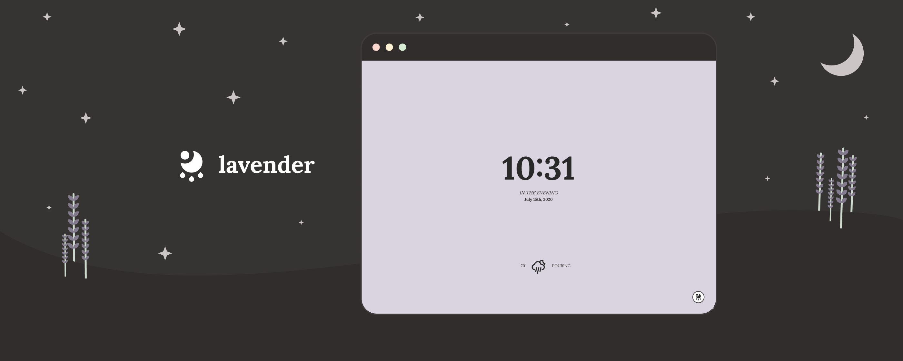

# lavender new tab 🌙

## features

lavender is a soft, minimal new tab for your chrome browser featuring:

-   live time & weather updates
-   5 calming background colors
-   alternative UI layouts
-   location-based weather fetching
-   metric units & 24-hour time formatting
-   options sync between chrome browsers

## installation

this extension has been submitted to the chrome web store for review. if you want to try it out before it's published, just do the following:

-   download the source code for lavender
-   sign up for the OpenWeather API [here](https://home.openweathermap.org/users/sign_upgenerate) and generate a new API key for the current weather API
-   within the .env.example file, paste your key directly after "VUE_APP_WEATHER_KEY=" and rename the file to .env
-   go to your chrome extensions page (chrome://extensions) and if you haven't already, turn on Developer mode (in the top right corner)
-   click "load unpacked" at the top and select the dist folder of lavender
-   opening a new tab should now load lavender ✨ enjoy!

## permissions & licensing

this app requires the following permissions:

| permission             | usage                                                                                       |
| ---------------------- | ------------------------------------------------------------------------------------------- |
| chrome & local storage | store user settings, sync across browsers                                                   |
| geolocation            | fetch weather - data is used to query [OpenWeather API](https://openweathermap.org/find?q=) |

this project is licensed under the MIT license. please feel free to browse the source code or use snippets for your own projects 💛

[privacy policy](https://github.com/fvrests/lavender/blob/main/privacy-policy.md)

[terms of use](https://github.com/fvrests/lavender/blob/main/terms-of-use.md)

feedback & suggestions are always welcome!

by [@fvrests](https://twitter.com/fvrests)

[donate 💕](https://givebutter.com/fvrests)
