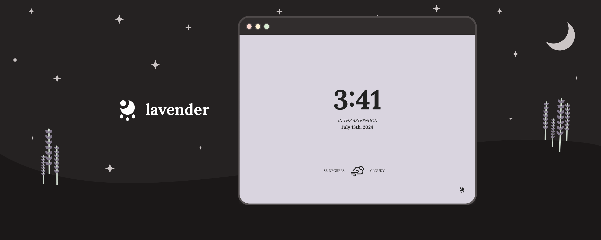

# lavender new tab 🌙

## features

lavender is a soft, minimal new tab for your chrome browser featuring:

-   live time & weather updates
-   5 calming background colors
-   alternative UI layouts
-   location-based weather fetching
-   metric units & 24-hour time formatting
-   options sync between chrome browsers

## download

[](https://chrome.google.com/webstore/detail/lavender-new-tab/ffobepdbanoiodmfimpmanafepclokbc)

## manual installation

-   clone or download lavender

```sh
$ git clone git@github.com:fvrests/lavender.git && cd lavender
```

-   sign up for [OpenWeather API](https://home.openweathermap.org/users/sign_upgenerate) and generate a new API key

-   within the .env.example file, paste your key directly after "VUE_APP_WEATHER_KEY=" and rename the file to .env

```sh
# .env
VUE_APP_WEATHER_KEY=<api_key>
```

-   install dependencies and build lavender (generating the necessary **dist** folder)

```sh
$ yarn && yarn build

# or using npm
$ npm install && npm run build
```

-   navigate to chrome://extensions and turn on developer mode (in the top right corner)
-   click "load unpacked" at the top and select the **dist** folder of lavender
-   opening a new tab should now load lavender ✨ enjoy!

## permissions & licensing

this app requires the following permissions:

| permission             | usage                                                                                       |
| ---------------------- | ------------------------------------------------------------------------------------------- |
| chrome & local storage | store user settings, sync across browsers                                                   |
| geolocation            | fetch weather - data is used to query [OpenWeather API](https://openweathermap.org/find?q=) |

this project is licensed under the MIT license. please feel free to browse the source code or use snippets for your own projects 💛

[privacy policy](https://github.com/fvrests/lavender/blob/main/privacy-policy.md) | [terms of use](https://github.com/fvrests/lavender/blob/main/terms-of-use.md)

feedback & suggestions are always welcome!

by [@fvrests](https://twitter.com/fvrests)

[donate 💕](https://givebutter.com/fvrests)
